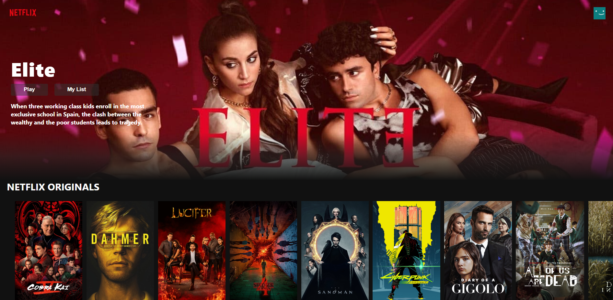

# **Netflix Clone** 📽️

### **`Project Info`**

> This project is for learning purposes only
>
> web application of movies and TV series representing a clone of the [NETFLIX](www.netflix.com) platform.

### 🎬 _**Was built with :**_

    

#

## **Rendering project** 📺

#

<!--
💳⚙️🔗🎥🪄📺📼🔊
! ERROR
: WARNING in ./node_modules/@firebase/util/dist/index.esm2017.js 741:19-44
: Critical dependency: the request of a dependency is an expression
! FIX WITH
+ npm install request@2.79.0 --save
-->

> ### _**Project still under development**_

Project still under construction for the moment it is possible to connect using an email address to access the catalog

###

#

### **`Learn More`**

- [Create React App](https://github.com/facebook/create-react-app)
- [Redux](https://redux.js.org/)
- [Redux Toolkit](https://redux-toolkit.js.org/)

- [React documentation](https://reactjs.org/).
